# SCTCA Climate Action Tracker — Database UML Diagram

```mermaid
erDiagram

    %% ============================================================
    %% LAYER 1: ACTIONS DATABASE
    %% ============================================================

    orgs {
        text org_id PK "e.g. ORG-10001"
        text org_name
        text org_url
        text org_acronym
        text org_logo
        text org_type "FK to org_types"
        text org_description
        text org_notes
        timestamptz created_at
        timestamptz updated_at
    }

    docs {
        text doc_id PK "e.g. DOC-10001"
        text doc_name
        text org_parent
        date doc_date
        text doc_type "FK to doc_types"
        text doc_url
        text doc_local
        text doc_evaluated "Y / N / ?"
        text doc_description
        text doc_notes
        timestamptz created_at
        timestamptz updated_at
    }

    actions {
        text act_id PK "e.g. ACT-10001"
        text doc_name
        text org_name
        text act_level1 "Goal"
        text act_level2 "Strategy"
        text act_level3 "Measure"
        text act_sector "FK to act_sectors"
        text act_spotlight
        text act_timeframe
        text act_status
        text act_timeline "FK to act_timelines"
        text act_actor
        text act_type
        text act_impacted
        text act_focus
        text act_results
        numeric act_priority
        text clearpath_url
        timestamptz created_at
        timestamptz updated_at
    }

    transitions {
        text trn_id PK "e.g. TRN-10001"
        text trn_name
        text trn_sector1
        text trn_sector2
        text trn_sector3
        text trn_type "FK to trn_types"
        text trn_examples
        timestamptz created_at
        timestamptz updated_at
    }

    indicators {
        text icr_id PK "e.g. ICR-10001"
        text icr_name
        timestamptz created_at
        timestamptz updated_at
    }

    resources {
        text res_id PK "e.g. RES-10001"
        text res_name
        text org_parent
        date res_date
        text res_type
        text res_url
        text res_description
        text res_notes
        timestamptz created_at
        timestamptz updated_at
    }

    %% ============================================================
    %% LAYER 2: PROJECTS DATABASE
    %% ============================================================

    projects {
        text prj_id PK "e.g. PRJ-10001"
        text prj_name
        text prj_status
        numeric prj_budget
        date prj_start_date
        date prj_end_date
        text prj_funding_source
        text prj_description
        text prj_notes
        text clearpath_url
        timestamptz created_at
        timestamptz updated_at
    }

    funding {
        text fnd_id PK "e.g. FND-10001"
        text fnd_name
        numeric fnd_amount
        text fnd_source
        text fnd_type
        date fnd_start
        date fnd_end
        text fnd_status "Applied / Awarded / Active / Closed"
        text fnd_url
        text fnd_notes
        timestamptz created_at
        timestamptz updated_at
    }

    individuals {
        text ind_id PK "e.g. IND-10001"
        text ind_name
        text ind_email
        text ind_title
        text ind_phone
        text ind_notes
        timestamptz created_at
        timestamptz updated_at
    }

    %% ============================================================
    %% LAYER 3: GHG INVENTORY
    %% ============================================================

    ghg_inventory {
        integer id PK
        integer year
        text jurisdiction
        text activity_type
        text activity_name
        text activity_sector
        text activity_sector2
        text activity_utility
        numeric activity_value
        text activity_units
        text activity_fuel_type
        numeric total_mtco2e
        numeric per_capita
        numeric per_household
        numeric per_employment
        numeric mtco2e_per_capita
        numeric mtco2e_per_household
        numeric mtco2e_per_employment
        text notes
    }

    %% ============================================================
    %% AUTH
    %% ============================================================

    user_roles {
        uuid id PK
        uuid user_id "FK to auth.users"
        text role "sctca_staff / jurisdiction_staff / viewer"
        text org_id "FK to orgs (for jurisdiction_staff)"
    }

    %% ============================================================
    %% ENUM / LOOKUP TABLES
    %% ============================================================

    doc_types {
        serial id PK
        text name UK "13 values"
    }

    act_sectors {
        serial id PK
        text name UK "9 values"
    }

    org_types {
        serial id PK
        text name UK "6 values"
    }

    act_timelines {
        serial id PK
        text name UK "3 values"
    }

    trn_types {
        serial id PK
        text name UK "4 values"
    }

    %% ============================================================
    %% JUNCTION TABLES (all many-to-many relationships)
    %% ============================================================

    org_org {
        text rel_id PK
        text rel_from FK "orgs.org_id"
        text rel_to FK "orgs.org_id"
        text name_from
        text name_to
        text rel_type
        text rel_type2 "Parent-Child / Parent-Program"
        text rel_direction
        text rel_notes
    }

    doc_org {
        text rel_id PK
        text rel_from FK "orgs.org_id"
        text rel_to FK "docs.doc_id"
        text name_from
        text name_to
        text rel_class
        text rel_type
        text rel_direction
        text rel_notes
    }

    act_doc {
        text rel_id PK
        text rel_from FK "docs.doc_id"
        text rel_to FK "actions.act_id"
        text name_from
        text name_to
        text rel_class
        text rel_type
        text rel_direction
        text rel_notes
    }

    act_trn {
        text rel_id PK
        text rel_from FK "actions.act_id"
        text rel_to FK "transitions.trn_id"
        text name_from
        text name_to
        text act_sector
        text rel_notes
    }

    trn_icr {
        text rel_id PK
        text rel_from FK "transitions.trn_id"
        text rel_to FK "indicators.icr_id"
        text name_from
        text name_to
        text rel_notes
    }

    org_res {
        text rel_id PK
        text rel_from FK "orgs.org_id"
        text rel_to FK "resources.res_id"
        text name_from
        text name_to
        text rel_class
        text rel_type
        text rel_direction
        text rel_notes
    }

    act_prj {
        text rel_id PK
        text rel_from FK "actions.act_id"
        text rel_to FK "projects.prj_id"
        text name_from
        text name_to
        text rel_class
        text rel_type
        text rel_direction
        text rel_notes
    }

    org_prj {
        text rel_id PK
        text rel_from FK "orgs.org_id"
        text rel_to FK "projects.prj_id"
        text name_from
        text name_to
        text rel_class
        text rel_type
        text rel_direction
        text rel_notes
    }

    prj_fnd {
        text rel_id PK
        text rel_from FK "projects.prj_id"
        text rel_to FK "funding.fnd_id"
        text name_from
        text name_to
        text rel_class
        text rel_type
        text rel_direction
        text rel_notes
    }

    org_fnd {
        text rel_id PK
        text rel_from FK "orgs.org_id"
        text rel_to FK "funding.fnd_id"
        text name_from
        text name_to
        text rel_class
        text rel_type
        text rel_direction
        text rel_notes
    }

    org_ind {
        text rel_id PK
        text rel_from FK "orgs.org_id"
        text rel_to FK "individuals.ind_id"
        text name_from
        text name_to
        text ind_role "free text with validation"
        text rel_class
        text rel_type
        text rel_direction
        text rel_notes
    }

    %% ============================================================
    %% RELATIONSHIPS
    %% ============================================================

    %% Layer 1: Actions chain
    orgs ||--o{ doc_org : "publishes"
    doc_org }o--|| docs : "documents"
    docs ||--o{ act_doc : "contains"
    act_doc }o--|| actions : "actions"
    actions ||--o{ act_trn : "requires"
    act_trn }o--|| transitions : "transitions"
    transitions ||--o{ trn_icr : "measured by"
    trn_icr }o--|| indicators : "indicators"

    %% Org hierarchy
    orgs ||--o{ org_org : "parent"
    org_org }o--|| orgs : "child"

    %% Org resources
    orgs ||--o{ org_res : "provides"
    org_res }o--|| resources : "resources"

    %% Layer 2: Projects
    actions ||--o{ act_prj : "implemented by"
    act_prj }o--|| projects : "projects"
    orgs ||--o{ org_prj : "manages"
    org_prj }o--|| projects : "projects"
    projects ||--o{ prj_fnd : "funded by"
    prj_fnd }o--|| funding : "funding"
    orgs ||--o{ org_fnd : "receives"
    org_fnd }o--|| funding : "funding"

    %% Contacts
    orgs ||--o{ org_ind : "employs"
    org_ind }o--|| individuals : "contacts"

    %% Auth
    user_roles }o--|| orgs : "scoped to"

    %% Enum lookups (dashed = soft reference by name, not FK)
    orgs }o..|| org_types : "type"
    docs }o..|| doc_types : "type"
    actions }o..|| act_sectors : "sector"
    actions }o..|| act_timelines : "timeline"
    transitions }o..|| trn_types : "type"
```



## Key Traversal Patterns

**To find Actions for an Organization:**
```
ORG → doc_org → DOC → act_doc → ACT
```

**To find Projects for an Organization:**
```
ORG → org_prj → PRJ  (direct)
ORG → doc_org → DOC → act_doc → ACT → act_prj → PRJ  (through actions)
```

**To find Funding for a Project:**
```
PRJ → prj_fnd → FND
```

**To find Contacts for an Organization:**
```
ORG → org_ind → IND
```

## Table Counts (as of build)

| Layer | Table | Rows |
|-------|-------|------|
| 1 | orgs | 253 |
| 1 | docs | 73 |
| 1 | actions | 1,061 |
| 1 | transitions | 213 |
| 1 | indicators | 6 |
| 1 | resources | 41 |
| 1 | org_org | 134 |
| 1 | doc_org | 73 |
| 1 | act_doc | 1,061 |
| 1 | act_trn | 33 |
| 1 | trn_icr | 6 |
| 1 | org_res | 41 |
| 2 | projects | 0 (schema ready) |
| 2 | funding | 0 (schema ready) |
| 2 | individuals | 0 (schema ready) |
| 3 | ghg_inventory | ~1,206 |
| Auth | user_roles | per user |
